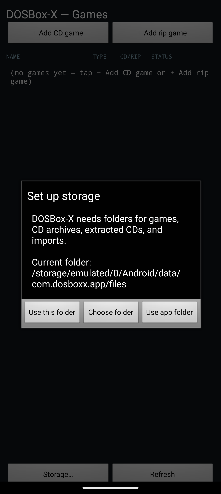
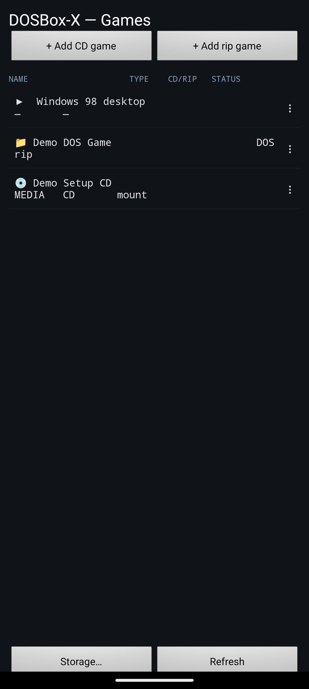
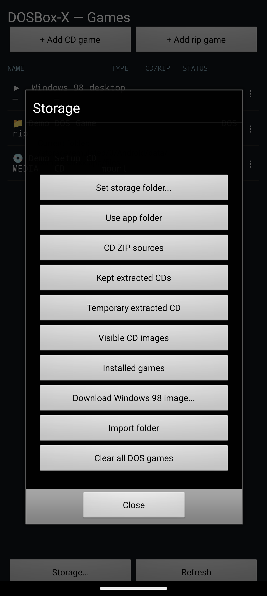
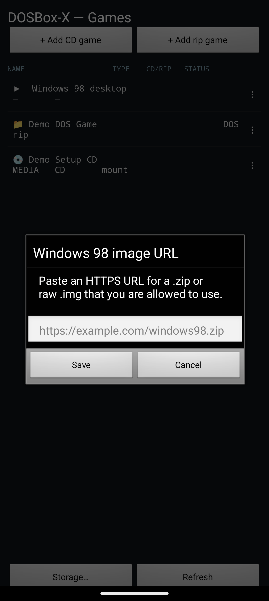
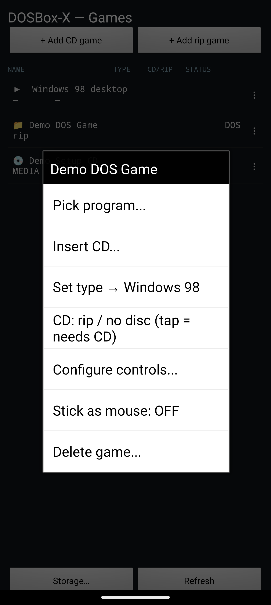
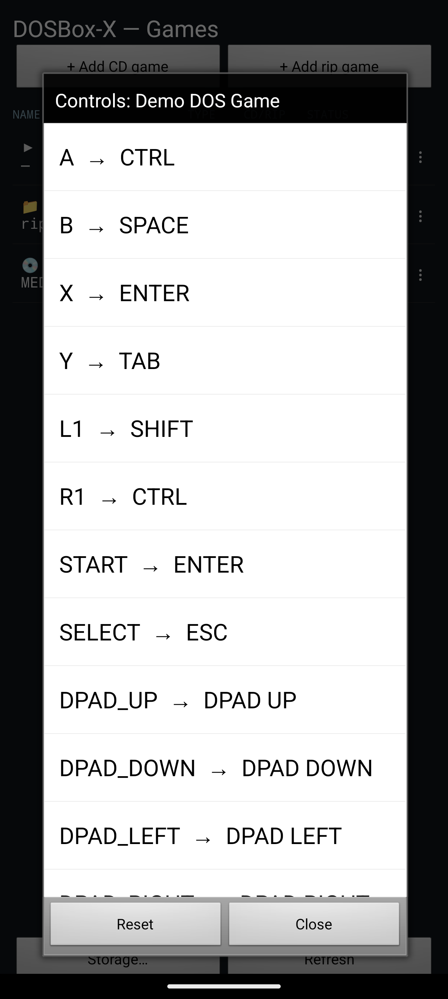

# DOSBox-X Android 🚀

Welcome to DOSBox-X Android! It's a handheld-focused Android launcher for DOSBox-X, and it's built around fast game launching, Windows 98 CD installs, and predictable storage management on handheld Android devices. Get ready to unleash the fun! 🎮

We totally revamped the layout and functionality, so hold onto your hats! It's way more awesome now!

## What It Adds ✨

- A unified, super cool games launcher for DOS games, CD games, and even Windows 98! 🤯
- A first-run setup wizard that holds your hand while you choose or confirm app-specific storage. No sweat! 💦
- A storage manager for all your archives, extracted CDs, visible images, imports, and installed games. Keep it tidy! 🧹
- ZIP CD source collection (with optional kept extracted copies for the hoarders among us).
- One temporary extracted CD mount at a time for archive-backed launches (because one is all you need!).
- Windows 98 CD setup with the selected CD mounted as `D:`. Classic! 📀
- Per-game CD/rip metadata and remembered CD source selection. We remember so you don't have to! 🧠
- Gamepad, keyboard overlay, mouse, and trackpad integration. Play how *you* want to play! 🕹️

## Check It Out! 👀

Here's how rad the new layout looks:








## Storage Model 🗂️

The app creates an app-specific base folder containing:

```text
games/
cds/
cds/.archives/
cds/.prepared-cds/
cds/.extracted-cds/
import/
```

`cds/.archives/` stores ZIP source packages. These sneaky things don't appear as launcher rows. Just use `+ Add CD game` to select them! 🤫

New files are imported through Android's system file picker. The emulator keeps real filesystem paths by storing imported files under the app-specific storage folder instead of requesting broad external storage access. Privacy first! 🛡️

`cds/.prepared-cds/` is temporary. The app clears old `run_*` folders before preparing another archive-backed CD. Poof! 💨

`cds/.extracted-cds/` stores kept extracted copies when you tick `Keep extracted copy`.

## Windows 98 CD Installs 💿

When starting a Windows 98 CD game setup, the launcher mounts:

- Win98 hard disk as `C:`
- selected CD-ROM as `D:`

This matches old installers that expect the CD drive to be `D:`. We love nostalgia! 📺

## Repository 💻

Source: <https://github.com/CrownParkComputing/Dosbox-X-Android>

License: GPL-2.0. The source repository includes GPL and third-party notices.
Paid distribution is allowed under the GPL, but recipients keep the GPL rights
to source code, copying, modification, and redistribution. Sharing is caring! 🤗
